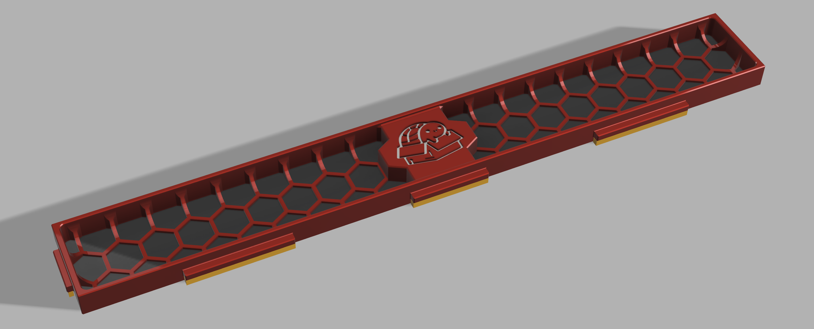
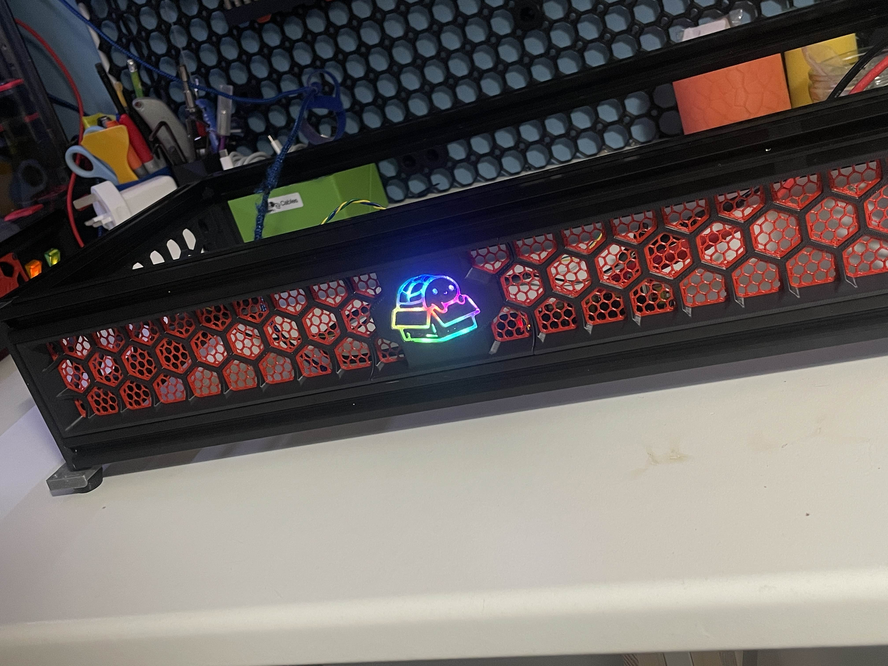

BoxTurtle Logo Panel front Skirt
===
This is an alternative front skirt for the BoxTurtle that includes a logo panel that can be illuminated using the LED Matrix panel provided or printed in your 2 colours to be a static logo.

Design Features
 - 17mm Wide, leaving 3mm on the inside of the BoxTurtle.
 - 1mm Thick mesh to allow a height range filament change at 1.2mm.
 - Mesh designed as single Body to allow outer walls to be used.
 - Turtle Logo designed in multiple parts to allow layer changes (Assuming your BT isn't built when this is being printed).
 - Designed to fit a 350mm Wide printer / 5 Lane BoxTurtle.



Assembly
===
1. Add 2 Heatset inserts to the back of the middle panel.

2. Press in your logo plate.

3. Assemble your LED Matrix and screw this in from behind using 2x M3x6 Screws.

4. Slide it into place on the printer.

Config
===

Assuming you have LED Effects installed, add this to the bottom of your `AFC_Hardware.cfg` file to get the rainbow effect behind the logo.
```
[neopixel bt_logo]
pin: AFC: PA2 #Set your own Pin
chain_count: 11
color_order: GRB
initial_RED: 1.0
initial_GREEN: 0.0
initial_BLUE: 0.0
initial_WHITE: 0.0

[led_effect rainbow_turtle]
leds:
    neopixel:bt_logo
autostart:                          true
frame_rate:                         24
layers:
    gradient  0.3  1 add (0.3, 0.0, 0.0),(0.0, 0.3, 0.0),(0.0, 0.0, 0.3)
```

Bill of Materials
===
Every link in the Bill of Materials is an affiliate link, This costs you nothing to use but helps buy me some filament and trinkets to make this kind of mod.

 - [2x M3x6 Screws (Not FHCS)](https://s.click.aliexpress.com/e/_DEccKQd)
 - [11x Neopixel LEDs](https://s.click.aliexpress.com/e/_DEccKQd)
 - [1m 26AWG Wire](https://s.click.aliexpress.com/e/_Dcg8I5b)
 - [1x JST-XHx3 Connector](https://s.click.aliexpress.com/e/_DE6E8Rn)

Upcoming Changes
===
 - Standard 4 Lane Version *If you beat me to it, let me know and i'll add it here*
 - Slimmed down (17mm) Side Panels

Thank Me
===
A few ways you can show your appreciation for my work:\
[Buy Me a Coffee](https://buymeacoffee.com/makermylo) | [Subscribe on YouTube](https://www.youtube.com/@makermylo) | [Follow on X](https://x.com/MakerMylo)
